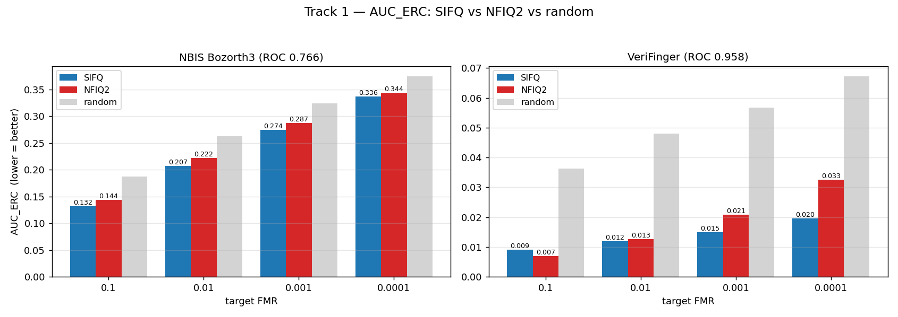
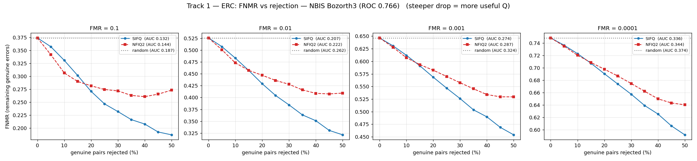
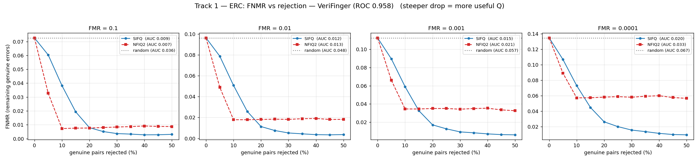
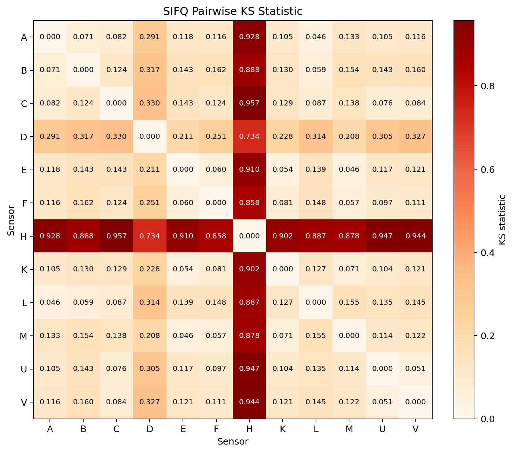
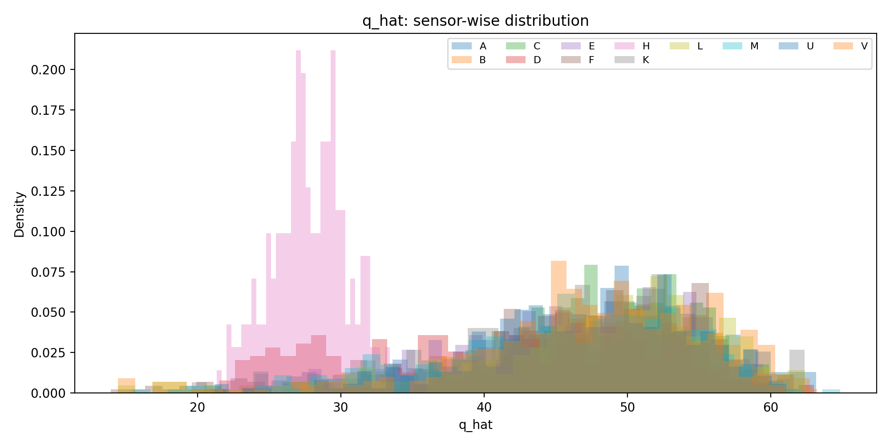
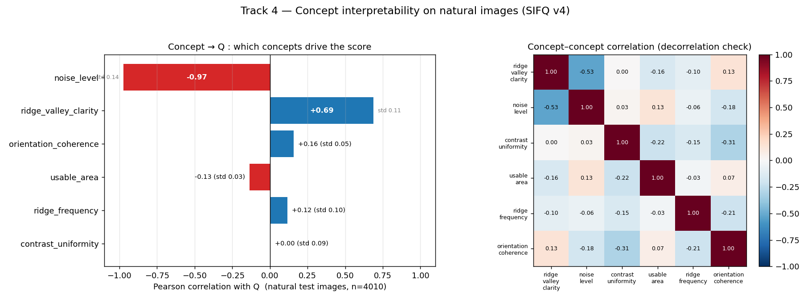
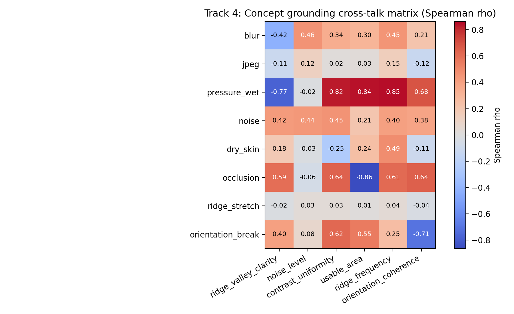

# SIFQ — Report: Sensor-Invariant Fingerprint Quality Assessment

> **TL;DR.** SIFQ is a small CNN that predicts a **fingerprint quality score `Q`** from **6 meaningful
> concepts**, trained **without any human-annotated quality labels**. The goal: `Q` measures **true
> biometric utility** — *invariant* to "cosmetic" differences between sensors, and only penalised when the
> biometric content is *genuinely* destroyed. On a cross-sensor test set (NIST SD302 + FVC), **SIFQ ≥ NFIQ2**
> at every operating point (Bozorth3 matcher) and is **~2.6× more sensor-invariant** than NFIQ2
> (KS 0.27 vs 0.69).

---

## 1. Introduction

Fingerprint image quality drives recognition accuracy: bad images make the matcher fail. The industry
standard is **NFIQ2** (NIST), but it is (a) a black box that is hard to interpret, (b) **sensor-dependent** —
the same finger captured by two different devices yields very different scores, and (c) tied to a training
recipe that needs utility labels.

**SIFQ (Sensor-Invariant Fingerprint Quality)** proposes a different route:

- **Concept Bottleneck Model:** `Q = quality_head(6 concepts)`. Because the final score is *forced* to pass
  through 6 named concepts, every `Q` is **explainable** as a combination of 6 factors.
- **Self-supervised:** no human quality labels. `Q` is learned from **3 label-free signals** (Section 4).
- **Core idea:** `Q` = *biometric utility*. Sensors that merely differ in texture/contrast (a "cosmetic"
  difference) should **not** lose points; points are deducted only when the biometric content (ridges,
  minutiae) is *genuinely* destroyed.

---

## 2. Data

| Item | Detail |
|---|---|
| Source | **NIST SD302** (a/b/d) + **FVC** (DB1/DB2/DB3) |
| Train | ~17,700 images (SD302 train + FVC), ~140 subjects, 2,200 finger identities |
| Test | **4,010 images**, **370 fingers**, 8–12 captures/finger, **37 subjects** (SD302a) |
| Sensors (test) | 12 devices: A, B, C, D, E, F, H, K, L, M, U, V |
| Finger identity | `identity` (subject) + `roll` (roll_01..roll_10 = the 10 fingers) |
| Key property | each finger is captured **once per sensor** → genuine pairs are **cross-sensor** (exactly the scenario invariance must handle) |

We also use **8 synthetic degradations** (blur, jpeg, pressure_wet, noise, dry_skin, occlusion,
ridge_stretch, orientation_break) for the `L_deg` signal and concept grounding (Sections 4, 5).

**Teacher:** the reference target `q_mat` comes from **FLaRE** (a fingerprint representation model), which is
NOT bundled in the repo — only its output `results/flare_qmat_train_fvc_blend.csv` is kept so the model can be
re-trained without re-running FLaRE.

---

## 3. Architecture

### 3.1 Overall data flow

The input is a grayscale fingerprint, replicated to 3 channels and resized to **224×224**. The backbone
extracts features, then the network splits into **two branches**: an *embedding* branch (identity) and a
*concept → Q* branch (quality).

```
grayscale image → 3 channels, 224×224
   │
   ▼  MobileNetV2.features   (inverted-residual, depthwise-separable conv)
feature map  7×7×1280
   ├───(global avg pool)──► 1280-d ─► proj[Linear 1280→256, ReLU, Linear 256→256] ─► L2-norm ─► embedding 256-d
   │                                                                                      └──► ArcFace (id_metric_weight 2200×256) ─► L_id
   │
   └─ concept_stem [Conv 1×1: 1280→64, ReLU]
          │
          ▼  f_intermediate maps  7×7×64
          ├───(pool)──► 64-d ──► GRL(λ) ──► sensor_head[64→64→15] ──► L_adv   (erase sensor information)
          │
          └─ concept_out [Conv 1×1: 64→6]
                 │
                 ▼  concept maps 7×7×6 ──(global avg pool, sigmoid)──► 6 concepts ∈ [0,1]
                        ├──► quality_head [Linear 6→12, ReLU, Linear 12→1, sigmoid] ──► Q ∈ [0,1]
                        └──► (light GRL, optional) concept_sensor_head[6→12→15] ──► L_advc
```

### 3.2 Module-by-module

| Module | In → Out | Role |
|---|---|---|
| `features` (MobileNetV2) | (3, 224, 224) → (1280, 7, 7) | lightweight feature extractor; **3-channel** input to reuse image-style pretraining |
| `proj` | 1280 → 256 → 256 (+L2-norm) | produces the **256-d embedding** for identity/analysis |
| `concept_stem` | Conv 1×1 (1280→64) + ReLU | produces **f_intermediate** (64-d) — *the attach point for the sensor adversary* |
| `concept_out` | Conv 1×1 (64→6) | produces 6 concept maps |
| pool + `sigmoid` | (6,7,7) → 6 | the **6 concepts ∈ [0,1]** |
| `quality_head` | 6 → 12 → 1 (+sigmoid) | the **bottleneck**: `Q` is a function of the 6 concepts only |
| `id_metric_weight` | 2200 × 256 | **ArcFace** (cosine-margin) weight classifying finger identity |
| `sensor_head` | GRL → 64 → 64 → 15 | **adversary** predicting the sensor from f_intermediate |
| `concept_sensor_head` | GRL → 6 → 12 → 15 | light direct adversary on the concepts (optional) |

**Footprint:** ~**2.74M parameters**, inference ~**20 ms/image** on a desktop CPU (13 MB checkpoint) — as
light as or lighter than NFIQ2, and GPU-capable.

### 3.3 The GRL (Gradient Reversal Layer) mechanism

`sensor_head` tries to predict the sensor from `f_intermediate`. **GRL** sits between them: the **forward**
pass is the identity (unchanged), the **backward** pass **multiplies the gradient by −λ**. As a result, while
`sensor_head` learns to classify the sensor, the reversed gradient **forces the backbone to erase** every
sensor cue from `f_intermediate`. Measured outcome: sensor-classification accuracy ≈ chance → sensor
information has been removed (Section 5, Track 2).

### 3.4 The six concepts (v4)

| Concept | Decreases with | Note |
|---|---|---|
| `ridge_valley_clarity` | blur, wet pressure, JPEG | ridge/valley sharpness |
| `noise_level` *(inverted)* | sensor noise | high score = low noise |
| `contrast_uniformity` | dry skin / uneven contrast | |
| `usable_area` | occlusion / small capture area | usable fraction of the image |
| `ridge_frequency` *(gated)* | ridge stretching / resolution loss | computed only where signal is sufficient |
| `orientation_coherence` *(gated)* | broken ridge flow | computed only where signal is sufficient |

### 3.5 Why these design choices

1. **Strict bottleneck** — `Q` depends on the 6 concepts only (verified: a linear regression `Q ≈ f(concepts)`
   reaches R² ≈ **0.997**). Hence every `Q` is **traceable** to 6 named factors → interpretable.
2. **GRL attaches to `f_intermediate` (64-d), NOT directly to the 6 concepts** — adversarial pressure on the
   6 dimensions would *collapse* the bottleneck (concepts go constant). Attaching to the intermediate layer
   removes the sensor signal while keeping the concepts alive.
3. **ArcFace (L_id)** — with only the teacher (one scalar per image) the backbone never "understands"
   fingerprints. ArcFace forces it to distinguish finger identities, so concepts like `ridge_clarity` and
   `minutiae` become *meaningful*. ArcFace's sensor leakage is cleaned by GRL (the leak lives in the
   *representation*, exactly where GRL acts).
4. **"Gated" concepts** (`ridge_frequency`, `orientation_coherence`) — measured only where ridge signal is
   sufficient, avoiding noise from background/empty regions.

---

## 4. Loss functions

`Q` is learned from 3 **label-free** signals plus 2 auxiliary losses:

| Loss | Role | Formula / idea |
|---|---|---|
| **L_mat** | matcher-as-teacher (utility) | `Huber(Q, q_mat)`, with `q_mat = sigmoid(normalize(FLaRE genuine score))` |
| **L_sens** | sensor invariance | GRL on `f_intermediate` (erase sensor) **+** *quality-aware* `L_pair` |
| **L_deg** | degradation ranking + grounding | `Q(clean) > Q(degraded)` by severity + each degradation drives **exactly 1 target concept** |
| **L_ortho** | concept decorrelation | always on, keeps the 6 concepts independent |
| **L_id** | ArcFace identity | makes the backbone "understand" fingerprints (minutiae, ridges) |

Two key improvements in this version:

1. **"Blend" normalization of `q_mat`.** `q_mat = sigmoid( α·global-z-score + (1−α)·per-sensor-z-score )` with
   α = 0.5. If we normalize *per-sensor only*, a **globally bad** sensor (e.g. SD302's sensor H) is pulled back
   to the mean → the "this device is genuinely bad" signal is lost. Blending keeps a bad device low.
2. **Quality-aware `L_pair`.** `L_pair = max(0, |Q(s1) − Q(s2)| − margin)` with
   `margin = max(delta=0.1, |q_mat(s1) − q_mat(s2)|)`. Two captures of the same finger are forced to have
   equal `Q` **only as far as** their true qualities actually agree → invariance is enforced for *cosmetic*
   differences, but `Q` is **allowed** to differ when one capture is *genuinely* worse.

**4-stage training schedule:** `id_warmup → add_q (L_mat) → add_invariance (GRL + L_pair) → finetune`
(with early stopping, patience 3).

---

## 5. Results

> **Headline:** on the same matcher and the same test set, **SIFQ ≥ NFIQ2 at every Bozorth3 operating point**,
> while also being **clearly more sensor-invariant**. `Q` is also **interpretable** through its concepts.

| Criterion | SIFQ v4 | NFIQ2 | Meaning |
|---|---|---|---|
| Track 1 — AUC_ERC (Bozorth, lower better) | **wins all 4 FMR** | — | Q is useful for a real matcher |
| Track 2 — cross-sensor KS (lower better) | **0.266** (0.140 excl. H) | 0.686 | ~2.6× more invariant |
| Track 2 — \|Q diff\| same finger (/100) | **3.3** | 19–28 | same finger → near-equal score |
| Track 4 — concepts that drive Q | clarity +0.69, noise −0.97 | (no concepts) | interpretable |

### Track 1 — ERC: does `Q` improve a real matcher?

We progressively reject the lowest-quality images; if `Q` is useful, the error (FNMR) **drops** ⇒ low
`AUC_ERC`. Compared on **2 independent matchers**: NBIS Bozorth3 (ROC 0.766) and VeriFinger (ROC 0.958).

**AUC_ERC (lower = better):**

| Matcher | Quality | FMR 0.1 | 0.01 | 0.001 | 1e-4 |
|---|---|---|---|---|---|
| Bozorth3 | **SIFQ** | **0.132** | **0.207** | **0.274** | **0.336** |
| Bozorth3 | NFIQ2 | 0.144 | 0.222 | 0.287 | 0.344 |
| VeriFinger | **SIFQ** | 0.009 | **0.012** | **0.015** | **0.020** |
| VeriFinger | NFIQ2 | 0.007 | 0.013 | 0.021 | 0.033 |

→ **SIFQ ≥ NFIQ2 at every level on Bozorth3, and at strict FMR on VeriFinger; both ≪ random.**







### Track 2 — Sensor invariance

The `Q` distribution across sensors should be **similar** (different only when a device is *genuinely* bad).
Measured by the KS distance between sensor pairs (lower = more invariant).

- **Mean KS: SIFQ 0.266** (0.140 excluding sensor H) vs **NFIQ2 0.686** (0.625).
- **|Q diff| same finger, cross-sensor: 3.3/100** (NFIQ2 19–28).
- The adversarial sensor classifier's accuracy ≈ chance ⇒ GRL successfully erased the sensor signal.
- Sensor **H** is genuinely bad on *every* matcher → SIFQ is correct to let H differ (hence the gap between
  0.266 and 0.140).





### Track 4 — Concept interpretability

**(a) On NATURAL images — which concepts drive `Q`:** `ridge_valley_clarity` **+0.69** and `noise_level`
**−0.97** are the strongest live concepts; concepts measuring factors that vary little on natural images are
weaker. The concept–concept correlation matrix shows **good decorrelation** (max off-diagonal 0.53).



**(b) On synthetic degradations — cross-talk:** does each degradation drive its **target concept** (strong
negative on the target cell), and how much does it "leak" into others? Strong grounding for
**pressure_wet → clarity (−0.77)**, **occlusion → usable_area (−0.86)**, **orientation_break → orientation
(−0.71)**.



### Limitations (honest reporting)

- **FLaRE teacher is a dependency** (not bundled); an earlier teacher (DeepPrint) was found to *encode the
  sensor instead of identity* and was dropped.
- **Small data** (~140 training subjects) and a **synthetic→natural gap**: concept grounding is validated on
  synthetic degradations; on natural images only ~2 concepts vary strongly — treat absolute concept values
  with care.
- Results are on NIST SD302 + FVC; baselines beyond NFIQ2 (SER-FIQ / CR-FIQA) are future work.

---

*Source code, model weights and all result files: see `code/`, `weights/`, `results/`.*
